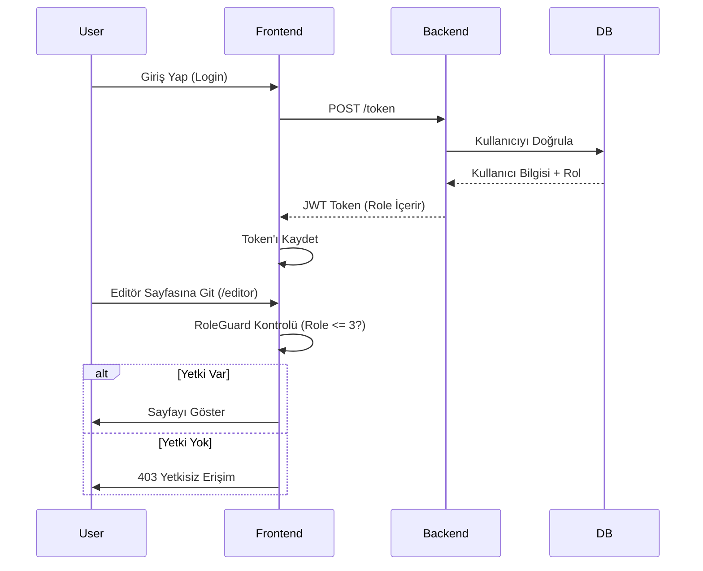

# 🚀 Proje Teknoloji Mimarisi

Bu proje, yüksek performanslı, ölçeklenebilir ve modern bir web deneyimi sunmak için seçilmiş en iyi teknolojileri bir araya getirir.

## 🏗️ Mimari Genel Bakış

```mermaid
graph TD
    User((👤 Kullanıcı))
    
    subgraph Frontend [🖥️ Frontend (Next.js 15+)]
        UI[Arayüz Componentleri]
        Editor[📝 Quill Editor]
        Dashboard[📊 Tremor Dashboard]
        Auth[🔐 RoleGuard RBAC]
    end
    
    subgraph Backend [⚙️ Backend (FastAPI)]
        API[FastAPI Router]
        AuthService[JWT & Hashing]
        ORM[SQLAlchemy]
    end
    
    subgraph Data [💾 Veri Katmanı]
        MySQL[(🐬 MySQL)]
        Redis[(⚡ Redis Cache)]
    end
    
    User -->|HTTPS| UI
    UI -->|REST API| API
    API -->|Query| ORM
    ORM -->|SQL| MySQL
    API -->|Cache| Redis
```

---

## 🎨 Frontend (İstemci Tarafı)

Kullanıcı deneyimini en üst düzeye çıkarmak için modern React ekosistemi kullanılmıştır.

| Teknoloji | Simge | Açıklama |
| :--- | :---: | :--- |
| **Next.js 15** | ⚫ | **App Router** mimarisi ile sunucu taraflı işleme (SSR) ve SEO optimizasyonu. |
| **Tailwind CSS** | 🌊 | Hızlı, esnek ve modern stil tanımlamaları. |
| **React Quill** | ✍️ | Zengin metin editörü. Yazarların içerik üretmesini kolaylaştırır. |
| **Tremor** | 📈 | Dashboard veri görselleştirmesi için profesyonel grafikler. |
| **Lucide Icons** | ✨ | Hafif, tutarlı ve güzel ikon seti. |

> [!TIP]
> **Neden Next.js?**
> Hem statik (SSG) hem dinamik (SSR) sayfaları aynı anda sunarak performansı artırır.

---

## ⚙️ Backend (Sunucu Tarafı)

Hız ve güvenilirlik için Python'un en hızlı web framework'ü seçilmiştir.

| Teknoloji | Simge | Açıklama |
| :--- | :---: | :--- |
| **FastAPI** | ⚡ | Python tabanlı, asenkron ve otomatik dökümantasyonlu (Swagger) API. |
| **SQLAlchemy** | 🗃️ | Python nesneleri ile veritabanı tablolarını eşleştiren güçlü ORM. |
| **Pydantic** | 🛡️ | Veri doğrulama ve tip güvenliği. |
| **JWT** | 🔑 | Güvenli kimlik doğrulama ve oturum yönetimi. |

---

## 💾 Veri ve Altyapı

| Teknoloji | Simge | Açıklama |
| :--- | :---: | :--- |
| **MySQL** | 🐬 | Ana veri saklama ünitesi. İlişkisel veritabanı. |
| **Redis** | 🔴 | Sık erişilen veriler için yüksek hızlı önbellek (Cache). |
| **Docker** | 🐳 | Tüm uygulamanın (Frontend, Backend, DB) tek komutla her yerde çalışmasını sağlar. |

---

## 🔐 Rol Tabanlı Yetkilendirme (RBAC)

Sistem güvenliği için hiyerarşik bir rol yapısı kurulmuştur:

1.  👑 **Admin**: Tam yetki.
2.  ✏️ **Editor**: İçerik yönetimi.
3.  📝 **Writer**: İçerik oluşturma.
4.  👀 **Reader**: Sadece okuma.


